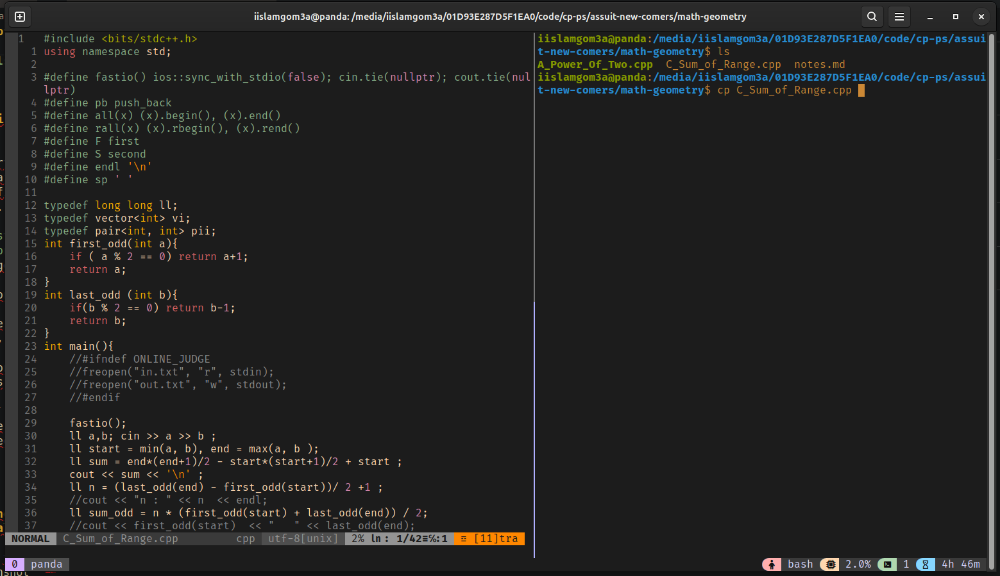

# Tmux Setup 

### 1.Install tmux 
```bash
sudo apt install tmux
```
### 2.make a config file 
```bash
nano ~/.tmux.conf
```
**paste the content to the file**

### 3.Install the Catppuccin theme for tmux 

```bash
mkdir -p ~/.config/tmux/plugins/catppuccin

git clone -b v2.1.0 https://github.com/catppuccin/tmux.git ~/.config/tmux/plugins/catppuccin/tmux

$ git clone https://github.com/tmux-plugins/tmux-cpu ~/.config/tmux/plugins/
```
### 4.run this command to apply changes
```bash
tmux source-file ~/.tmux.conf
```
---

# Neovim Setup 

This guide explains how to install and configure Neovim with useful plugins and settings using [`vim-plug`](https://github.com/junegunn/vim-plug), the **Gruvbox** colorscheme, and **coc.nvim**.

---

## Installation Steps

### 1.Install Prerequisites

```bash
sudo apt install neovim curl git 
```

### 2. Install Node.js (Required for coc.nvim)

[Node.js offical website](https://nodejs.org/en/download)


### 3.Install a Nerd font & use it in the terminal

[Nerd Fonts website](https://www.nerdfonts.com/)

### 4. Create Configuration Folder

```bash
mkdir -p ~/.config/nvim
```

---

### 5. Add the `init.vim` Configuration

Create the config file:

```bash
nvim ~/.config/nvim/init.vim
```

**Paste the contents from your config.**

---

### 6. Install Plugins

```vim
:PlugInstall
```

### 7. Install Coc Extensions (Optional)

Inside Neovim, run:

```vim
:CocInstall coc-clangd coc-json coc-tsserver coc-html coc-css
```

Install extensions based on your development needs.

---

## Plugins

- [`vim-airline`](https://github.com/vim-airline/vim-airline) – status/tabline
- [`gruvbox`](https://github.com/morhetz/gruvbox) – color scheme
- [`coc.nvim`](https://github.com/neoclide/coc.nvim) – Intellisense engine

---


## Final Tips

- Restart Neovim after any config changes.
- Use `:CocList extensions` to manage CoC extensions.
- For language support, ensure corresponding servers (like `clangd` for C++) are installed.

---

## Screenshot 


---
